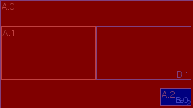
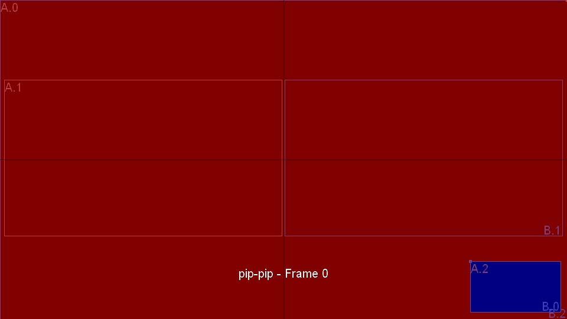

# Vocotomix Transitions

## TOC
<!-- TOC depthFrom:2 depthTo:3 withLinks:1 updateOnSave:1 orderedList:0 -->

- [TOC](#toc)
- [Purpose](#purpose)
- [Use Cases](#use-cases)
	- [Composites](#composites)
	- [Transitions](#transitions)
- [Operations](#operations)
	- [Composite Operations](#composite-operations)
	- [Transition Operations](#transition-operations)
- [Interfaces](#interfaces)
	- [Composites](#composites)
	- [Transitions](#transitions)
- [Entities](#entities)
	- [Transition](#transition)
	- [Composite](#composite)
	- [Frame](#frame)
- [Configuration](#configuration)
	- [Configure Composites](#configure-composites)
	- [Configure Transitions](#configure-transitions)
- [Using Transitions](#using-transitions)
- [Transition Tester](#transition-tester)
	- [Example Usage](#example-usage)
	- [Using verbose mode](#using-verbose-mode)
	- [Code](#code)
- [TODO](#todo)
	- [Future Development](#future-development)

<!-- /TOC -->

## Purpose

The purpose of _voctomix_ __transitions__ is to implement an easy way to semi-automatize fading from one _video mixing scenario_ to another. We call those scenarios __composites__. A composite in _voctomix_ traditionally consists of up to two mixed video sources __A__ and __B__ whose representation parameters we call __frames__.

So far _voctomix_ was capable of using the following preset composites:

- single source __*c*(A)__
  - single source full screen (fs)
- two sources __*c*(A,B)__
  - side-by-side (sbs)
  - picture-in-picture (pip)
  - side-by-side-preview (sbsp)

Until transitions existed in _voctomix_, switching between any of these compositing scenarios was made rapidly from one frame to the next. The idea of transitions is to fade between composites by doing an animation and/or alpha (transparency) blending. With _voctomix_ __transitions__ we like to produce the most expected result for every possible scenario and give the user also the ability to create new composites and adjust or improve existing ones or even invent new transitions.

## Use Cases

### Composites

A __composite__ is a mix of multiple source images sources into a single destination image.
The _voctomix_ project was previously using four fixed composites called _fullscreen_, _picture-in-picture (pip)_, _side-by-side_ and _side-by-sidepreview_. We can divide these transitions into the following categories.
_Voctomix_ also uses a background source image which will not be discussed here because it is just irrelevant for handling transitions.  

The images below show source <span style="color:red">__A__</span> in red and source <span style="color:blue">__B__</span> in blue.

#### c(A), c(B)


We name these kind of composites __c(A)__ or __c(B)__.

#### c(A,B)


We name these kind of composites __c(A,B)__.

We later also differ between overlapping and __non-overlapping composites__.
_pip_ for example is an __overlapping composite__ because the image of source B overlaps that of source A.

### Transitions

Generally we can differ between the following transition cases.

#### *c*(A) &harr; *c*(B)


First case is to switch from one full screen source to another by switching A &harr; B. The most common method here is to blend transparency of both sources from one to the other.

#### *c*(A) &harr; *c*(A,B)


Switch from full screen to a composite of both sources can be done by blending the alpha channel of the added source from transparent to opaque or by an animation of the incoming source or both.

#### *c*(B) &rarr; *c*(A,B)


#### *c*(A,B) &harr; *c*(B,A)


To switch between A and B within a composite an animation is preferable. In some composites like _picture-in-picture_ (see in the middle) the second source (B) is overlapping the first one (A) and so the *z-order* (order in which the frames have to be drawn) has to be flipped within a transition to get a proper effect.

To guarantee that this is possible transitions can be improved by inserting so-called __intermediate composites__ which add __key frames__ for both sources in which they do not overlap and so bring a chance to do the z-order swap.
_voctomix_ __transitions__ is then using *B-Splines* to interpolate a smooth motion between __*c*(A,B)__ &harr; __*t'*(A,B)__ &harr; __*c*(B,A)__. You even can use multiple intermediate composites within the same transition, if you like.

#### *c<sub>1</sub>*(A,B) &harr; *c<sub>2</sub>*(A,B)


Switching the composite while leaving the sources A and B untouched is similar to the previous case __*c*(A,B)__ &harr; __*c*(B,A)__ except that there is usually no need to have intermediate composites to switch the z-order because A and B remain unswapped.

#### *c<sub>1</sub>*(A,B) &harr; *c<sub>2</sub>*(B,A)


#### Three-Sources Transitions

Switching a source of one frame within a composite to another (external) source leads to a *three-sources transition* because three sources have to be mixed together simultaneously.
To avoid the complexity of transitions of such a higher grade we like to stay with the real use cases which occur when working with *voctomix*.
We exclude all three sources transitions except those of one type.   

##### *c*(A<sub>1</sub>) &harr; *c*(A<sub>2</sub>)
When you start with a single source composite and you switch that one input source to another one which is not the hidden source B, you just have to switch source B to A<sub>2</sub> first and then do a two source transition *c*(A<sub>1</sub>) &harr; *c*(B) which is then equivalent to *c*(A<sub>1</sub>) &harr; *c*(A<sub>2</sub>).

##### *c*(A) &harr; *c*(A,B<sub>2</sub>)

We easily can cover this one with the same switching maneuver as in the previous case.

##### *c*(A<sub>1</sub>,B) &harr; *c*(A<sub>2</sub>,B)

The remaining one is different:
If you want to switch one of the sources within a two source composite to a new (external) source you need a real three sources transition to animate that case.

Again we like to restrict that issue to the real use case where we use just one type of three source transition which is based on a two source transitions and just mixes one source to another external by transparency fading.

This case is currently out of scope for transitions and is solved within the mixer.

## Operations

To minimize the amount of composites and transitions which must be configured, missing composites and transitions shall be auto-generated.
The rules to do that are listed below.

Mostly these operations are inserted automatically.
They are described here for better understanding of how _voctomix_ **transitions** work and to understand the debugging output of the resulting code.

### Composite Operations

#### Equivalence

A frame of empty size is invisible like one which is fully transparent but has an extent.
Also a composite of two frames where one is opaque and overlapping the other completely includes one invisible frame.
So those kind of composites may be treated as equivalent if one frame differs in both composites by some properties but is overall still invisible in both.

So when _voctomix_-**transitions** is looking for a matching composite it uses this rule which shortens the list of necessary manual transition definitions.

#### Swap

A composite of source A and B _c(A,B)_ can be swapped by simply swapping A and B like in this example:


We mark that swap operation with a `^` sign.
Put into a formula we can write this as

<center>
^*c*(A,B) = *c*(A,B)
</center>

#### Gamma

The **gamma operation** is used for that one remaining *three sources transition* case when you switch one of the sources to another input within a two source composite.

Taking a two source composite *c*(A,B) and a third source C this operation has a transition *T* as result.  

We describe that with the upper case Greek letter **Γ** as:

<center>
*T* = Γ(*c*,C) = Γ(*c*(A,B),C) = *c*(A,B) &rarr; *c*(A,C)
</center>
or
<center>
*T* = Γ(C,*c*) = Γ(C,*c*(A,B)) = *c*(A,B) &rarr; *c*(C,B)
</center>

Where *T* is the resulting transition, *c* is the current composite and *A*,*B* and *C* the related sources.  

Because *voctomix* **transitions** are focusing on two sources composites and translations we will integrate that case in separately into the mixer.

### Transition Operations

#### Reverse


A transition *T* from composite *c<sub>1</sub>* to composite *c<sub>2</sub>* written as...

*T* = *c<sub>1</sub>* &rarr; *c<sub>2</sub>*

...can be reversed.

We mark that reverse operation with an exponent of <sup>`-1`</sup>:

*T*<sup>-1</sup> = (*c<sub>1</sub>*(A,B) &rarr; *c<sub>2</sub>*(A,B))<sup>-1</sup> = *c<sub>2</sub>*(A,B) &rarr; *c<sub>1</sub>*(A,B)

Or shorter:

*T*<sup>-1</sup> = (*c<sub>1</sub>* &rarr; *c<sub>2</sub>*)<sup>-1</sup> = *c<sub>2</sub>* &rarr; *c<sub>1</sub>*

#### Phi &Phi;()

This operation is needed to handle some transitions between _overlay composites_.
It works different because it does not change a transition but it's processing.
We call that operation _&Phi;()_.

Overlay composites have a so-called _z-order_ which defines that B is drawn above A.
If you take an overlay composite like _picture-in-picture_, generating an animation for swapping both sources must include a switch of this z-order.

This is done with the _&Phi;()_ operation which finds the first composite within a transition where source B do not even partially cover the image of source A.
To profit by this operation one must specialize this transition an put a non-overlaying composite between the target composites.

So to get a proper picture-in-picture &arr; picture-in-picture transition we can put a side-by-side composite between:

<center>
&Phi;(*pip* &harr; *sbs* &harr; *pip*)
</center>

The result with a side-by-side composite in the middle looks like:



On the left you can see the added side-by-side composite as rectangles and you can see that A and B are swapping somewhere within the animation.

Without side-by-side in the middle it would look like:


...which is worse than a hard cut.

## Interfaces

To use the following code you first need to import some stuff.

```python
from transitions import Transitions, Composites
```

Maybe importing `L`, `T`, `R` and `B` is a good idea too because it can be helpful when accessing the coordinates of the resulting animation frames.
`X` and `Y` can be used to access width and height in `size`.


### Composites

`Composites` (plural) is a python class of the preferred interface to _voctomix_ __composites__ and includes the following function:

#### Composites.configure()
Reads a configuration and returns all included composites.
Take that return value and give it to `Transitions.configure()` to load the transitions configuration.
You may also use the included composites to set up your compositor's switching capabilities - for example in the user interface.
```python
def configure(cfg, size):
```
Additionally you have to give `size` which must be a list including _width_ and _height_ in pixels of both source frames.
It is an external parameter and should be given by your compositor configuration.
`size` will be used to calculate coordinates from any proportional floating point values inside the configuration and for calculating source related coordinates of any cropping.

The return value is a dictionary of `string` &rarr; `Composite`.

`configure()` may throw an `RuntimeError` exception when parsing the syntax causes problems.

In *future development* this could also take different `size` values for each source too.

### Transitions

`Transitions` holds a transition table from all configured target composites to each other.

#### Transitions.configure()
Reads a configuration and returns all included transitions.
Take that return value and give it to `find()` to fetch a specific transition.
```python
def configure(cfg, composites, fps=25):
```
Generates all transitions configured by the list of named configuration values in dictionary `cfg` (`string` &rarr; `string`) by using the given `composites` and `fps` (frames per second) and return them in a dictionary of `string` &rarr; `Transition`.

`configure()` may throw an `RuntimeError` exception when parsing the syntax causes problems.

#### Transitions.add()
This method is mainly used internally by `config()` but you also can use it to add transitions manually to the transition table.
```python
def add(self, transition, frames, overwrite=False):
```
`transition` is added to at all position in the table where it matches.
`frames` is the number of frames the (re-)calculated transition shall last.
When `overwrite` is `False` existing transitions will not be overwritten.

#### Transitions.find()
Fetch a transition whose beginning and ending is matching the given composites.
```python
def find(begin, end):
```
Searches in the given dictionary `transitions` for a transition that fades `begin` to `end`.
In a second step also checks if reversed versions transitions match.
If a transition was found a tuple of it's name and the transition will be returned - otherwise `None`.

#### Transitions.travel()
Returns a list of pairs of composites along all possible transitions between all given `composites` by walking the tree of all combinations recursively.
```python
def travel(composites, previous=None):
```
Parameter `previous` shall always be the default `None` and must only be used internally for recursion.
This method is just a tool to walk all possible transitions in one animation and so concatenate existing transitions.

Currently it is only used within the _Transition Tester_ to generate test output but could be also subject of *future development* to generate more complex animations by concatenation.

## Entities

### Transition

A transition consists of a list of composites.
These composites can be either:
- two or more in a list of __key composites__ to generate an animation for
- or a list of composites which describe an already generated animation and so a ready-to-go transition.

#### Transition.frames()
Returns the number of composites stored in this transition.
```python
def frames(self):
```
The return value can be either the _number of key frames_ or the _number frames of an animation_ depending on if this transition instance is meant to be used as a parameter to calculate an animation or as return value of that calculation.

#### Transition.A/B()
Returns one frame of the sources A or B which shall be realized within your compositor.
```python
def A(self, n):
def B(self, n):
```
Precisely returns `Frame` number `n` of source A or B of the `Transtition`.

#### Transition.flip()
Return the index of the frame preferred to flip both sources (and the scenario) to get a proper z-order behavior.
```python
def flip(self):
```
Using this information is strongly recommended to get smooth results, when using transitions of type *c*(A,B) &harr; *c*(B,A).

#### Transition.begin/end()
Returns the begin or end composite of that transition.
```python
    def begin(self):
    def end(self):
```

#### Transition.name()
Returns the name of that transition.
```python
    def name(self):
```

### Composite

A `Composite` instance includes two frames for source A and B and includes no functions you need to know about to use _voctomix_ __transitions__.

#### Composite.inter
Marks intermediate composites if `True`.
```
self.inter = False
```
Intermediate composites can be marked by this flag to avoid their appearance in an UI selection for example.

### Frame

A __Frame__ includes all the information necessary to set up a single source in your compositor:

#### Frame.rect
Returns the dimensions in pixels of this frame.
```python
self.rect = [0, 0, 0, 0]
```
The value is a list of coordinates of the _left_, _top_, _right_ and _bottom_ of the frame.
Use imported constants `L`, `T`, `R` and `B` to access these list elements.
The default is an empty rectangle in the upper-left corner.

#### Frame.alpha
The transparency value of this frame.
```python
self.alpha = 255
```
A value between `0` and `255` where `0` means invisible, `255` means opaque and values between describe the corresponding semi-transparency.


#### Frame.crop
The source's cropping values which may change within a transition animation.
```python
self.crop = [0, 0, 0, 0]
```
The values are the _left_, _top_, _right_ and _bottom_ cropping meant as distance from the frame's originally borders.
Because cropping is a property of the video source these values will be related to the source size given to `Composites.configure()`.  

#### Frame.key
This member is `True` if this is a key frame loaded from the configuration or `False` if it was generated by interpolation.
```python
self.key = False
```

#### Frame.cropped()
Returns the cropped rectangle of the frame related to the current size of the frame.
```python
def cropped(self):
```
Use this to get the resulting frame's extent which will be visible in the image mixed by your compositor.


## Configuration

Configuration is done with an INI file like all the other _voctomix_ configuration.

Additionally we like to leave the configuration as easy and compatible as possible to former configurations.
Because we also like to increase the flexibility, any unification of the composites does indeed lead to a quite different configuration format.
To keep migration easy the basic options and values are mostly just reordered or renamed.  

### Configure Composites

List of configurations of custom named composites for mixing video sources A and B.

Attribute       | Format | Default     | Description
----------------|--------|-------------|-------------------------------------
_name_`.a`      | RECT   | no output   | position and size of frame A
_name_`.b`      | RECT   | no output   | position and size of frame B
_name_`.crop-a` | CROP   | no cropping | cropping borders of frame A
_name_`.crop-b` | CROP   | no cropping | cropping borders of frame B
_name_`.alpha-a`| ALPHA  | opaque      | opacity of frame A
_name_`.alpha-b`| ALPHA  | opaque      | opacity of frame B
_name_`.noswap` | BOOL   | swap        | prevents to target swapped composite

So a default frame without any attributes is invisible by his zero extent.

#### _name_
All attributes begin with the composite's name followed by a dot `.` and the attribute's name.
A composite can be freely named but _name_ must be unique.

#### Absolute and Proportional Coordinates

In __RECT__ and __CROP__ you may decide if you like to use _absolute pixel coordinates_ or _proportional floating point values_.
Using proportional values is often an advantage because you can easily change the full screen size once and all other pixel values will be automatically calculated with that size.
This enables you to use the same composites configuration with different resolutions but similar aspect ratio.

#### RECT
Rectangular coordinates are given in different formats like: `X/Y WxH`, `POS WxH`, `X/Y SIZE`, `POS SIZE` or `*`.

Whereat `X`,`Y`,`W`,`H` can be mixed integer pixel coordinates or float proportions.
`POS` and `SIZE` need to be float proportions.
`*` stands for full screen and inserts the `size` which was once given to `Composites.configure()`.

##### Examples
```ini
c.a = 10/10 100x100          ; source A pixel dimensions with format 'X/Y WxH'
```
```ini
c.a = 0.4 0.2                ; source A float proportions with format 'XY WH'
```
```ini
c.a = 0.1/10 0.9             ; stupid mixup with format 'X/Y WH'
c.b = *                      ; source B becomes full screen
```

#### CROP
Cropping borders which are given by either `L/T/R/B`, `LR/TB` or `LRTB`

`L`,`T`,`R`,`B`, `LR`,`TB` and `LRTB` can be mixed integer absolute coordinates or float
proportions.

##### Examples
```ini
c.crop-a = 0/100/0/100       ; source A pixel cropping borders with format 'L/T/R/B'
```
```ini
c.crop-a = 0.0/0.2           ; source A float proportional borders with format 'LR/TB'
```
```ini
c.crop-b = 0.1               ; source B 10% from each border in format 'LRTB'
```

#### ALPHA

Integer value in the range between `0` (invisible) and `255` (opaque) or float value between `0.0` (invisible) and `1.0` (opaque) or `*` (also opaque).

#### BOOL

Any value is true but false if empty.

##### Examples
```ini
c.alpha-a = *                 ; opaque source A using '*'
c.alpha-b = 0.5               ; 50% semitransparent source B as float
```

### Configure Transitions

The configuration of a transition is more easy.
List all transitions in an ini section like `[transitions]`.
Each one can be freely named and describes a timespan and a list of composites which will be processed into an animation. Interpolation will be linear with two composites and B-Splines for more.

```ini
my_transition = 1000, pip / sidebyside
```
This generates a linear transition from composite `pip` to composite `sidebyside` lasting one second (`1000` milliseconds).
```ini
my_transition = 1500, pip / sidebyside / pip
```
This generates a B-Spline transition from composite `pip` to composite `sidebyside` to composite `pip` (with A and B automatically swapped) with a duration of one and a half seconds (`1500` milliseconds).

## Using Transitions

```python
  from transitions import Composites, Transitions, L, T, R, B
  from configparser import SafeConfigParser
  from out_of_scope import update_my_compositor

  # set frame size
  size = [1920, 1080]
  # set frames per second
  fps = 25
  # load INI files
  config = SafeConfigParser()
  config.read(filename)
  # read composites config section
  composites = Composites.configure(config.itemc('composites'), size)
  # read transitions config section
  transitions = Transitions.configure(config.itemc('transitions'), composites, fps)

  # search for a transitions that does a fade between fullscreen and sidebyside composites
  t_name, t = Transitions.find(composites["fullscreen"], composites["sidebyside"], transitions)
  # stupid loop through all frames of the animation
  for i in range(t.framec()):
    # access current frame in animation to update compositing scenario
    update_my_compositor( t.A(i), t.B(i) )
```

## Transition Tester

The transitions tester lists information about what composites and transitions are defined in a configuration called `composite.ini` and generates PNG files or animated GIF for each listed transition.
You may also select additional drawing of cropping, key frames or a title by command line option or take a further look into the calculations by using verbose mode.

```raw
▶ python3 testtransition.py -h  
usage: testtransition.py [-h] [-m] [-l] [-g] [-t] [-k] [-c] [-C] [-r] [-n]
                         [-P] [-L] [-G] [-v]
                         [composite [composite ...]]

transition - tool to generate voctomix transition animations for testing

positional arguments:
  composite       list of composites to generate transitions between (use all
                  available if not given)

optional arguments:
  -h, --help      show this help message and exit
  -m, --map       print transition table
  -l, --list      list available composites
  -g, --generate  generate animation
  -t, --title     draw composite names and frame count
  -k, --keys      draw key frames
  -c, --corners   draw calculated interpolation corners
  -C, --cross     draw image cross through center
  -r, --crop      draw image cropping border
  -n, --number    when using -g: use consecutively numbers as file names
  -P, --nopng     when using -g: do not write PNG files (forces -G)
  -L, --leave     when using -g: do not delete temporary PNG files
  -G, --nogif     when using -g: do not generate animated GIFS
  -v, --verbose   also print WARNING (-v), INFO (-vv) and DEBUG (-vvv)
                  messages

```

### Example Usage

```
▶ python3 testtransition.py -lvgCctk pip
1 targetable composite(s):
	pip
1 intermediate composite(s):
	fullscreen-pip
saving transition animation file 'pip-pip.gif' (pip-pip, 37 frames)...
1 transitions available:
	pip-pip
```

This call generates the following animated GIF:



You can see the key frames of `pip` `A.0`=`B.2` and `B.0`=`A.2` of the start and end composite. In the vertical center you can see the key frames `A.1` and `B.1` given by `sidebyside` to produce a moment of non-overlapping. At the first time when the blue frame `B` is not overlapping the red one `A` the flipping point is reached and sources `A`/`B` can be flipped without side effects.

The following configuration file was used to generate that animation:

```ini
[output]
; full screen size in pixels
size         = 960x540
; frames per second to render
fps          = 25

[composites]
; Frame A full screen
pip.a        = *
; frame B lower-right corner with 16% size
pip.b        = 0.83/0.82 0.16

; left-middle nearly half size
sidebyside.a = 0.008/0.25 0.49
; right-middle nearly half size
sidebyside.b = 0.503/0.25 0.49

[transitions]
; transition from pip to pip (swapped) over sidebyside within 1.5 seconds
pip-pip      = 1500, pip / sidebyside / pip
```

### Using verbose mode

In verbose mode you can see more information about how a transition will be found and what it's data looks like:

```raw
▶ python3 testtransition.py -vvv pip
reading composites from configuration...
read 2 composites:
	sbs
	pip
reading transitions from configuration...
adding transition pip-pip = pip -> pip
	pip-pip = pip -> pip:
	No. Key A(   L,   T     R,   B alpha  LCRP,TCRP,RCRP,BCRP  XZOM,YZOM)	B(   L,   T     R,   B alpha  LCRP,TCRP,RCRP,BCRP  XZOM,YZOM)  Name
	  0  *  A(   0,   0   240, 135   255     0,   0,   0,   0  0.00,0.00)	B( 199, 110   237, 131   255     0,   0,   0,   0  0.00,0.00)  pip
	  1  *  A(   1,  33   118,  99   255     0,   0,   0,   0  0.00,0.00)	B( 120,  33   237,  99   255     0,   0,   0,   0  0.00,0.00)  sbs
	  2  *  A(   0,   0   240, 135   255     0,   0,   0,   0  0.00,0.00)	B( 199, 110   237, 131   255     0,   0,   0,   0  0.00,0.00)  pip
calculating transition pip-pip = pip/sbs/pip
read 1 transition(s):
	pip-pip
using 1 target composite(s):
	pip
generated sequence (2 items):
	pip
	pip
request transition (1/1): pip → pip
transition found: Φ(pip-pip)
	Φ(pip-pip) = pip -> pip:
	No. Key A(   L,   T     R,   B alpha  LCRP,TCRP,RCRP,BCRP  XZOM,YZOM)	B(   L,   T     R,   B alpha  LCRP,TCRP,RCRP,BCRP  XZOM,YZOM)  Name
	  0  *  A(   0,   0   240, 135   255     0,   0,   0,   0  0.00,0.00)	B( 199, 110   237, 131   255     0,   0,   0,   0  0.00,0.00)  pip
	  1     A(   0,   0   239, 135   255     0,   0,   0,   0  0.00,0.00)	B( 199, 110   237, 131   255     0,   0,   0,   0  0.00,0.00)  ...
	  2     A(   0,   0   238, 134   255     0,   0,   0,   0  0.00,0.00)	B( 198, 108   238, 130   255     0,   0,   0,   0  0.00,0.00)  ...
	  3     A(   4,   0   234, 130   255     0,   0,   0,   0  0.00,0.00)	B( 196, 106   240, 131   255     0,   0,   0,   0  0.00,0.00)  ...
	  4     A(   9,   0   228, 123   255     0,   0,   0,   0  0.00,0.00)	B( 193, 101   245, 130   255     0,   0,   0,   0  0.00,0.00)  ...
	  5     A(  15,   1   219, 116   255     0,   0,   0,   0  0.00,0.00)	B( 188,  95   249, 129   255     0,   0,   0,   0  0.00,0.00)  ...
	  6     A(  21,   2   208, 107   255     0,   0,   0,   0  0.00,0.00)	B( 182,  87   254, 127   255     0,   0,   0,   0  0.00,0.00)  ...
	  7     A(  24,   4   194, 100   255     0,   0,   0,   0  0.00,0.00)	B( 175,  79   258, 126   255     0,   0,   0,   0  0.00,0.00)  ...
	  8     A(  27,   6   180,  92   255     0,   0,   0,   0  0.00,0.00)	B( 167,  70   261, 123   255     0,   0,   0,   0  0.00,0.00)  ...
	  9     A(  26,   9   164,  87   255     0,   0,   0,   0  0.00,0.00)	B( 157,  60   260, 118   255     0,   0,   0,   0  0.00,0.00)  ...
	 10     A(  20,  13   147,  84   255     0,   0,   0,   0  0.00,0.00)	B( 145,  50   256, 112   255     0,   0,   0,   0  0.00,0.00)  ...
	----------------------------------------------------------- FLIP SOURCES ------------------------------------------------------------
	 11     B(  11,  20   130,  87   255     0,   0,   0,   0  0.00,0.00)	A( 133,  41   248, 106   255     0,   0,   0,   0  0.00,0.00)  ...
	 12  *  B(   1,  33   118,  99   255     0,   0,   0,   0  0.00,0.00)	A( 120,  33   237,  99   255     0,   0,   0,   0  0.00,0.00)  sbs
	 13     B(   1,  32   118,  98   255     0,   0,   0,   0  0.00,0.00)	A( 119,  32   236,  98   255     0,   0,   0,   0  0.00,0.00)  ...
	 14     B(  10,  51   125, 116   255     0,   0,   0,   0  0.00,0.00)	A( 104,  24   223,  91   255     0,   0,   0,   0  0.00,0.00)  ...
	 15     B(  30,  64   141, 126   255     0,   0,   0,   0  0.00,0.00)	A(  88,  17   215,  88   255     0,   0,   0,   0  0.00,0.00)  ...
	 16     B(  55,  74   158, 132   255     0,   0,   0,   0  0.00,0.00)	A(  72,  11   210,  89   255     0,   0,   0,   0  0.00,0.00)  ...
	 17     B(  80,  83   174, 136   255     0,   0,   0,   0  0.00,0.00)	A(  57,   7   210,  93   255     0,   0,   0,   0  0.00,0.00)  ...
	 18     B( 106,  90   189, 137   255     0,   0,   0,   0  0.00,0.00)	A(  43,   4   213, 100   255     0,   0,   0,   0  0.00,0.00)  ...
	 19     B( 131,  96   203, 136   255     0,   0,   0,   0  0.00,0.00)	A(  30,   2   217, 107   255     0,   0,   0,   0  0.00,0.00)  ...
	 20     B( 154, 101   215, 135   255     0,   0,   0,   0  0.00,0.00)	A(  19,   1   223, 116   255     0,   0,   0,   0  0.00,0.00)  ...
	 21     B( 172, 105   224, 134   255     0,   0,   0,   0  0.00,0.00)	A(  11,   0   230, 123   255     0,   0,   0,   0  0.00,0.00)  ...
	 22     B( 187, 107   231, 132   255     0,   0,   0,   0  0.00,0.00)	A(   5,   0   235, 130   255     0,   0,   0,   0  0.00,0.00)  ...
	 23     B( 195, 109   235, 131   255     0,   0,   0,   0  0.00,0.00)	A(   1,   0   239, 134   255     0,   0,   0,   0  0.00,0.00)  ...
	 24  *  B( 199, 110   237, 131   255     0,   0,   0,   0  0.00,0.00)	A(   0,   0   240, 135   255     0,   0,   0,   0  0.00,0.00)  pip
```

As you can see the triple verbose mode (using option `-vvv`) prints out a list of loaded composites and found transitions too, like option `-l` does.

Additionally it prints out:
- the composites used to request the transition `pip -> pip` including a mark `(swapped)` at the right margin indicates that this transition has the same begin and end frame and so it will be swapped,
- the searched transitions (in this case there is only one),
- the long table which shows the calculated animation for this transition and all it's properties,
- the _flipping point_ at `--- FLIP SOURCES ---` from which on the letters for A and B are swapped and
- also the `*` signs which mark the used key frames from the composites out of the configuration.

#### Transition Table

To examine the automatically generated composites and transitions you can print out the transition table with `-m`:

```
▶ python3 testtransition.py -m
transition table:
       fs-a                pip                 sbs                 sbsp                fs-b                ^sbsp               ^sbs                

 fs-a  Φ(def(fs-a/fs-a))   fs-a-pip            fs-a-sbs            fs-a-sbsp           fs-fs               ^fs-b-sbsp          ^fs-b-sbs           
  pip  fs-a-pip⁻¹          Φ(pip-pip)          def(pip/sbs)        def(pip/sbsp)       fs-b-pip⁻¹          def(pip/^sbsp)      def(pip/^sbs)       
  sbs  fs-a-sbs⁻¹          def(sbs/pip)        Φ(sbs-sbs)          def(sbs/sbsp)       fs-b-sbs⁻¹          def(sbs/^sbsp)      Φ(_sbs-sbs⁻¹)       
 sbsp  fs-a-sbsp⁻¹         def(sbsp/pip)       def(sbsp/sbs)       Φ(def(sbsp/sbsp))   fs-b-sbsp⁻¹         Φ(def(sbsp/^sbsp))  def(sbsp/^sbs)      
 fs-b  Φ(fs-fs⁻¹)          Φ(fs-b-pip)         fs-b-sbs            fs-b-sbsp           Φ(^fs-fs)           ^fs-a-sbsp          ^fs-a-sbs           
^sbsp  ^fs-b-sbsp⁻¹        def(^sbsp/pip)      def(^sbsp/sbs)      Φ(def(^sbsp/sbsp))  ^fs-a-sbsp⁻¹        Φ(def(^sbsp/^sbsp)) def(^sbsp/^sbs)     
 ^sbs  ^fs-b-sbs⁻¹         def(^sbs/pip)       Φ(_sbs-sbs)         def(^sbs/sbsp)      ^fs-a-sbs⁻¹         def(^sbs/^sbsp)     Φ(^sbs-sbs)     

```

The table has rows of all configured start target composites and columns of end target composites.
Every cell includes the available transitions.  

### Code

#### main program
The program consists of several functions which are called from a main block:

```python
read_argumentc()
init_log()
render_sequence(*read_config("composite.ini"))
```
`render_sequence()` takes exactly what `read_config()` is delivering.

#### read_argumentc()
Reads command line arguments like described above.
```python
def read_argumentc():
```
Fills global `Args` with the parser result.

#### init_log()
Initializes debug logging.
```python
def init_log():
```
Global `log` gets the logger instance.

#### read_config()
Read from the given file.
```python
def read_config(filename):
```
`filename` is the name of the configuration file.

#### render_compositec()

Renders pictures of all `composites` and saves them into PNG files.

```python
def render_compositec(size, composites):
```
Produces images of the given `size`.

#### render_sequence()

Render all transitions between all items in the given sequence by using `safe_transition_gif()` (see below).

```python
def render_sequence(size, fps, targets, transitions, composites):
```

Sequence is defined by the names listed in `targets`.
Produces images of the given `size`.
Calculate with `fps` frames per second and use the `transitions` and `composites` dictionaries to find matching transitions.

#### save_transition_gif()

Generates an animated GIF of the given name of an animation by using `draw_transition()` (see below)

```python
def save_transition_gif(filename, size, name, animation, time):
```

`filename` is the name of the resulting file, `size` it's dimensions, `name` the displayed title, `animation` the transition to render and `time` the duration of that whole animation in the GIF.

#### draw_composite()
Function that draws one composite and returns an image.

```python
def draw_composite(size, composite, swap=False):
```

Produces images of `composite` in the given `size` which can be drawn swapped by using `swap`.

#### draw_transition()
Internal function that draws one transition and returns a list of images.

```python
def draw_transition(size, transition, name=None):
```

Produces images of `transition` in the given `size`.

## TODO
#### Integration into exisiting _voctomix_

To get out video transition effect within _voctomix_ the configuration needs a format update and the compositor must be extended by the ability to switch the compositing scenario quickly frame by frame synchronized with the play time.

#### Review the coordinate formats
...in RECT and CROP so we do not hurt someone's feelings.

### Future Development

- May be have just one `configure()` in `Transitions` which returns both composites and transitions so that you only need to import the Transitions interface instead of additionally the composites interface.
- Decide in which way three source scenarios like *c*(A<sub>1</sub>,B) &harr; *c*(A<sub>2</sub>,B) or *c*(A,B<sub>1</sub>) &harr; *c*(A,B<sub>2</sub>) can profite from any kind of specialized transitions.
- What about unlimited sources?
- add additional composite operations (like visual mirroring)?
