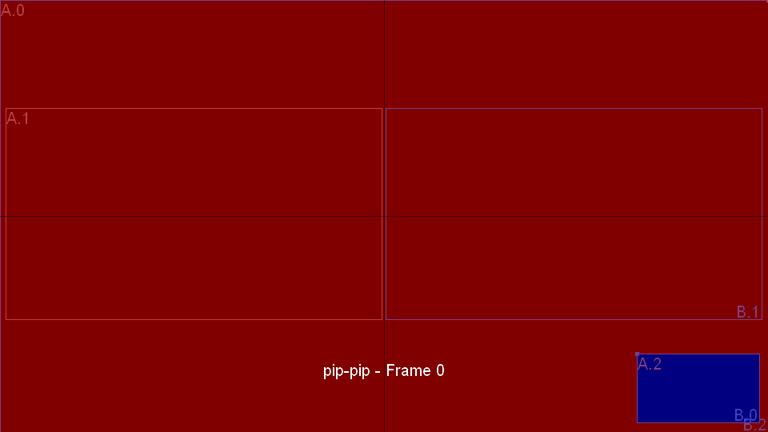

Composites and Transitions
==========================

A *composite* is a layout that places up to two sources (A and B) into the
output frame. A *transition* is an animated fade between two composites.
voctomix interpolates key frames using B-Splines to produce smooth motion.

.. contents:: Contents
   :depth: 2
   :local:

Built-in composite types
------------------------

Source A is shown in red, source B in blue in the diagrams below.

Single-source composites — **c(A)** / **c(B)**
   One source fills the whole frame; the other is not rendered.

   .. image:: transitions/images/fullscreen.png
      :alt: fullscreen A composite

   .. image:: transitions/images/fullscreen-b.png
      :alt: fullscreen B composite

Two-source composites — **c(A,B)**
   Two sources share the frame. Available layouts:

   .. image:: transitions/images/pip.png
      :alt: picture-in-picture composite

   .. image:: transitions/images/sidebyside.png
      :alt: side-by-side composite

   .. image:: transitions/images/sidebysidepreview.png
      :alt: side-by-side preview composite

   * **fullscreen** — one source at full size, the other invisible
   * **pip** (picture-in-picture) — B overlaps A in a small window;
     an *overlapping composite* because B's frame covers part of A
   * **sbs** (side-by-side) — A and B share equal halves
   * **sbsp** (side-by-side-preview) — a wide main view beside a narrow
     preview

Configuring composites
-----------------------

Composites are defined in the ``[composites]`` section using the form
``<name>.<attribute> = <value>``.

.. code-block:: ini

   [composites]
   ; source A fills the whole frame, B is invisible (alpha=0)
   fullscreen.a       = 0/0/1920/1080
   fullscreen.alpha-b = 0

   ; side-by-side: equal halves
   sidebyside.a = 0/0/960/1080
   sidebyside.b = 960/0/1920/1080

   ; picture-in-picture: B overlaps A in the bottom-right corner
   pip.a = 0/0/1920/1080
   pip.b = 1440/810/1920/1080

**Frame attributes** (prefix with composite name and dot):

``<name>.a``
   Position and size of source A as a ``RECT``. Default: no output (invisible).

``<name>.b``
   Position and size of source B as a ``RECT``. Default: no output (invisible).

``<name>.crop-a``
   Cropping borders of frame A as ``CROP``. Default: no cropping.

``<name>.crop-b``
   Cropping borders of frame B as ``CROP``. Default: no cropping.

``<name>.alpha-a``
   Opacity of source A as ``ALPHA``. Default: ``255`` (opaque).

``<name>.alpha-b``
   Opacity of source B as ``ALPHA``. Default: ``255`` (opaque).

``<name>.noswap``
   Any non-empty value prevents this composite from being targeted as a
   swapped composite (``^c``). Default: swap allowed.

``<name>.inter``
   Mark as an intermediate composite, hiding it from the UI. Default: ``false``.

**RECT** — rectangular coordinates in any of these formats:

* ``X/Y WxH`` — pixel coordinates, e.g. ``10/10 100x100``
* ``POS WH`` — float proportions, e.g. ``0.4 0.2``
* ``X/Y WH`` — mixed, e.g. ``0.1/10 0.9``
* ``*`` — full screen (uses the ``size`` from ``[output]``)

Both ``X``, ``Y``, ``W``, ``H`` can be integer pixels or float proportions
(0.0–1.0 relative to the output frame).

**CROP** — cropping borders in any of these formats:

* ``L/T/R/B`` — four individual values, e.g. ``0/100/0/100``
* ``LR/TB`` — two symmetric pairs, e.g. ``0.0/0.2``
* ``LRTB`` — single value for all sides, e.g. ``0.1`` (10% from each border)

**ALPHA** — transparency as integer ``0``–``255``, float ``0.0``–``1.0``,
or ``*`` (opaque).

Transition use cases
---------------------

voctomix handles all pairwise transitions between configured composites.
The following cases cover the full space:

c(A) ↔ c(B) — swap full-screen source
   Both sources cross-fade by blending their alpha channels.

   .. image:: transitions/images/fullscreen-fullscreen.gif
      :alt: fullscreen A to fullscreen B transition

   .. image:: transitions/images/fullscreen-fullscreen-both.gif
      :alt: fullscreen to fullscreen transition (both sources visible)

c(A) ↔ c(A,B) — introduce a second source
   The incoming source slides or fades into the frame.

   .. image:: transitions/images/fullscreen-pip.gif
      :alt: fullscreen to pip transition

   .. image:: transitions/images/fullscreen-sidebyside.gif
      :alt: fullscreen to side-by-side transition

   .. image:: transitions/images/fullscreen-sidebysidepreview.gif
      :alt: fullscreen to side-by-side-preview transition

c(B) → c(A,B) — bring in A alongside B
   The hidden source A is introduced into the frame while B remains visible.

   .. image:: transitions/images/fullscreen-b-pip.gif
      :alt: fullscreen B to pip transition

   .. image:: transitions/images/fullscreen-b-sidebyside.gif
      :alt: fullscreen B to side-by-side transition

   .. image:: transitions/images/fullscreen-b-sidebysidepreview.gif
      :alt: fullscreen B to side-by-side-preview transition

c(A,B) ↔ c(B,A) — swap sources within a composite
   An animation moves both sources to their new positions. For overlapping
   composites (e.g. pip), the z-order must be flipped mid-transition. Insert a
   non-overlapping intermediate composite (e.g. sbs) so the flip can happen
   cleanly — see the Phi (Φ) operation described under `Auto-generated transitions`_.

   .. image:: transitions/images/pip-pip.gif
      :alt: pip to pip (swapped) transition

   .. image:: transitions/images/sidebyside-sidebyside.gif
      :alt: side-by-side to side-by-side (swapped) transition

   .. image:: transitions/images/sidebysidepreview-sidebysidepreview.gif
      :alt: side-by-side-preview to side-by-side-preview (swapped) transition

c₁(A,B) ↔ c₂(A,B) — change composite layout
   Sources animate to their new positions; A and B remain unswapped so no
   z-order flip is usually needed.

   .. image:: transitions/images/sidebyside-sidebysidepreview.gif
      :alt: side-by-side to side-by-side-preview transition

   .. image:: transitions/images/sidebysidepreview-sidebyside.gif
      :alt: side-by-side-preview to side-by-side transition

   .. image:: transitions/images/sidebyside-pip.gif
      :alt: side-by-side to pip transition

c₁(A,B) ↔ c₂(B,A) — change layout and swap sources
   Both the composite layout and the source assignment change simultaneously.

   .. image:: transitions/images/sidebyside-sidebysidepreview-b.gif
      :alt: side-by-side to side-by-side-preview (B,A) transition

   .. image:: transitions/images/sidebysidepreview-sidebyside-b.gif
      :alt: side-by-side-preview to side-by-side (B,A) transition

   .. image:: transitions/images/sidebyside-b-pip.gif
      :alt: side-by-side B to pip transition

Configuring transitions
------------------------

Transitions are defined in the ``[transitions]`` section:

.. code-block:: ini

   [transitions]
   ; name = duration_ms, from_composite / to_composite
   FADE      = 750, fullscreen / fullscreen
   SBS_FADE  = 500, fullscreen / sidebyside
   PIP_SWAP  = 600, pip / sidebyside / pip

Format::

   <name> = <duration_ms>, <composite1> / [<intermediate> /] <composite2>

* **duration_ms** — transition length in milliseconds. Two composites produce
  a linear interpolation; three or more use B-Spline interpolation.
* Intermediate composites between ``/`` separators are key frames inserted
  to enable z-order flips (see below).
* Missing reverse transitions are generated automatically.
* Missing transitions between composites not listed here are inferred via
  equivalence and swap operations.

Auto-generated transitions
---------------------------

To keep configuration concise, voctomix applies the following operations
automatically when building the transition table:

**Reverse (T⁻¹)**
   A transition *c₁ → c₂* is automatically reversed to also cover *c₂ → c₁*.

   .. image:: transitions/images/sidebysidepreview-sidebyside.gif
      :alt: forward transition

   .. image:: transitions/images/sidebyside-sidebysidepreview.gif
      :alt: same transition reversed

**Swap (^)**
   A composite *c(A,B)* can be swapped to *c(B,A)* by exchanging sources.
   This doubles the number of reachable composites without extra configuration.

   .. image:: transitions/images/sidebyside.png
      :alt: side-by-side c(A,B)

   .. image:: transitions/images/sidebyside-swapped.png
      :alt: side-by-side c(B,A) — sources swapped

**Equivalence**
   Composites where one source is entirely invisible (zero extent, zero alpha,
   or fully occluded) are treated as equivalent for transition matching
   purposes, reducing the number of transitions you need to configure manually.

**Phi (Φ) — z-order flip**
   For overlapping composites like pip, transitions that include a
   non-overlapping intermediate composite get the z-order flipped at the right
   frame automatically.

   With a ``sidebyside`` intermediate (recommended):

   .. image:: transitions/images/pip-pip-key.gif
      :alt: pip to pip transition with z-order flip via side-by-side intermediate

   The key frames (A.0/B.2 = pip, A.1/B.1 = sidebyside) are visible as
   rectangles. At the first frame where B no longer overlaps A, the sources
   are flipped cleanly.

   Without an intermediate composite (result is worse than a hard cut):

   .. image:: transitions/images/pip-pip-default.gif
      :alt: pip to pip transition without intermediate — poor result

   Configuration:

   .. code-block:: ini

      [transitions]
      PIP_SWAP = 600, pip / sidebyside / pip

Transition operations: the Gamma (Γ) case
------------------------------------------

When you switch one source within a two-source composite to an external source
(e.g. *c(A₁,B) → c(A₂,B)*), voctomix handles this as a three-source
transition by first switching the hidden source and then doing a standard
two-source transition. This is automatic and requires no extra configuration.

Using transitions from the GUI
-------------------------------

Press the **trans** button (default: ``Space``) instead of **cut** (``Return``)
to trigger a transition. voctomix selects the appropriate transition from the
table automatically based on the current and target composites.

The **retake** button (``BackSpace``) reverts the last mix action.

Transition tester
-----------------

A standalone script renders all configured transitions to image/gif files
for visual inspection:

.. code-block:: bash

   python3 voctocore/tests/transitions/transition_tester.py \
       -i voctocore/default-config.ini

Command-line options::

   usage: transition_tester.py [-h] [-m] [-l] [-g] [-t] [-k] [-c] [-C] [-r]
                                [-n] [-P] [-L] [-G] [-v]
                                [composite [composite ...]]

   positional arguments:
     composite       composites to generate transitions between (default: all)

   optional arguments:
     -h, --help      show this help message and exit
     -m, --map       print transition table
     -l, --list      list available composites
     -g, --generate  generate animation files
     -t, --title     draw composite names and frame count
     -k, --keys      draw key frames
     -c, --corners   draw calculated interpolation corners
     -C, --cross     draw image cross through center
     -r, --crop      draw image cropping border
     -n, --number    use consecutively numbered file names
     -P, --nopng     do not write PNG files (forces -G)
     -L, --leave     do not delete temporary PNG files
     -G, --nogif     do not generate animated GIFs
     -v, --verbose   print WARNING (-v), INFO (-vv) or DEBUG (-vvv) messages

Example — generate the pip-pip animation with all overlays:

.. code-block:: bash

   python3 transition_tester.py -lvgCctk pip

Output::

   1 targetable composite(s):
       pip
   1 intermediate composite(s):
       fullscreen-pip
   saving transition animation file 'pip-pip.gif' (pip-pip, 37 frames)...
   1 transitions available:
       pip-pip

The annotated output shows key frames (marked ``*``), the side-by-side
intermediate, and the ``--- FLIP SOURCES ---`` point where A and B are swapped.

Transition table
~~~~~~~~~~~~~~~~

Print the full auto-generated transition table with ``-m``::

   python3 transition_tester.py -m

Each cell shows the transition name (including any Φ, ⁻¹, or ^ decorators)
used to animate between the row's start composite and the column's end
composite. Cells with ``def(…)`` are auto-generated default transitions;
cells with named entries were explicitly configured.
