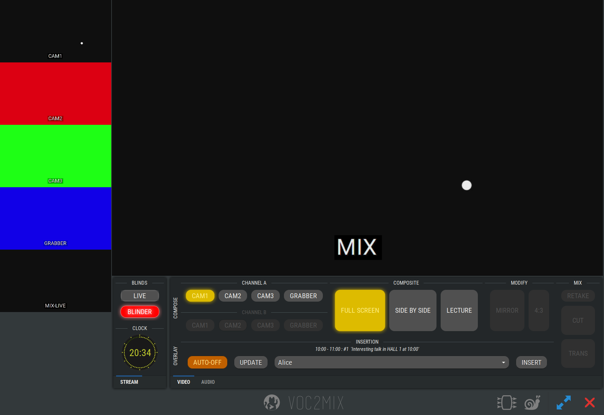

voctogui
========

voctogui is the graphical control interface for :doc:`../voctocore/index`.
It connects to a running voctocore instance over TCP and provides:

* Live previews of all sources and the mix
* Source selection buttons for channels A and B
* Composite and transition controls
* Blinder (stream blanker) toggle
* Overlay / lower-third insertion controls
* Expert views: port status, queue depths

Server configuration takes precedence
--------------------------------------

When voctogui connects to voctocore, the server's configuration is merged
into the client's. All options except ``server/host`` can be defined in the
voctocore config and will be used by all connecting GUI instances automatically.
This means you generally only need ``server/host`` in the GUI config file.

See :doc:`configuration` for the full option reference.
