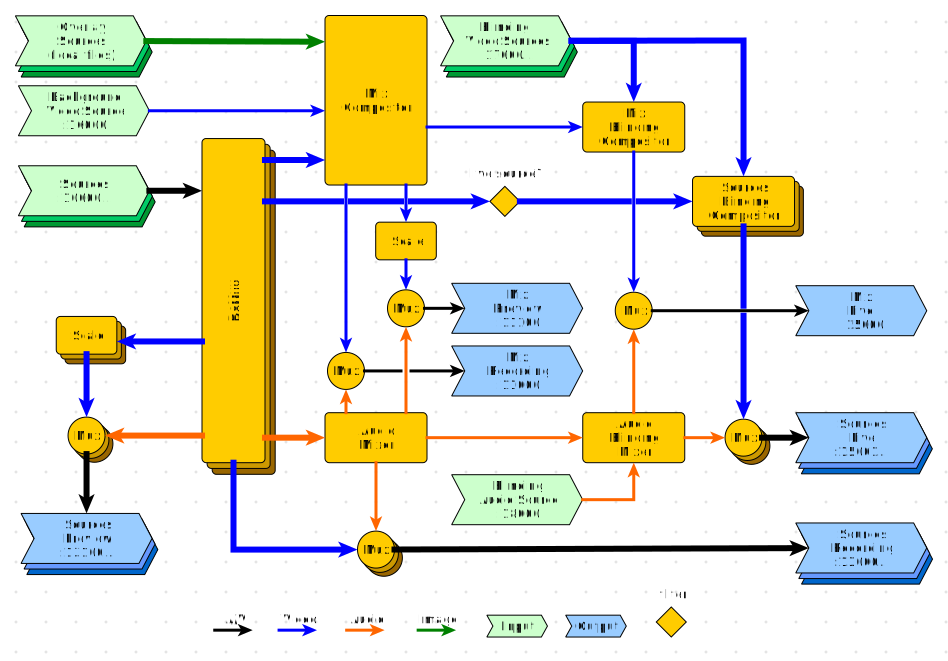

# VOC2CORE

## Table of contents
<!-- TOC depthFrom:2 depthTo:6 withLinks:1 updateOnSave:1 orderedList:0 -->

- [Table of contents](#table-of-contents)
- [Purpose](#purpose)
- [Features](#features)
- [Mixing Pipeline](#mixing-pipeline)
	- [Input Elements](#input-elements)
		- [Sources](#sources)
			- [Test Sources](#test-sources)
			- [TCP Sources](#tcp-sources)
			- [Decklink Sources](#decklink-sources)
			- [Image Sources](#image-sources)
			- [Common Source Attributes](#common-source-attributes)
		- [Background Video Source](#background-video-source)
		- [Blinding Video Sources](#blinding-video-sources)
		- [Blinding Audio Source](#blinding-audio-source)
		- [Overlay Sources](#overlay-sources)
	- [Output Elements](#output-elements)
		- [Mix Live](#mix-live)
		- [Mix Recording](#mix-recording)
		- [Mix Preview](#mix-preview)
		- [Sources Live](#sources-live)
		- [Sources Recording](#sources-recording)
		- [Sources Preview](#sources-preview)
	- [A/V Processing Elements](#av-processing-elements)
		- [DeMux](#demux)
		- [Mux](#mux)
	- [Video Processing Elements](#video-processing-elements)
		- [Scale](#scale)
		- [Mix Compositor](#mix-compositor)
		- [Mix Blinding Compositor](#mix-blinding-compositor)
		- [Sources Blinding Compositor](#sources-blinding-compositor)
	- [Audio Processing Elements](#audio-processing-elements)
		- [Audio Mixer](#audio-mixer)
		- [Audio Blinding Mixer](#audio-blinding-mixer)
	- [Filters](#filters)
		- [Live Source?](#live-source)
- [Installation]
<!-- /TOC -->

## Purpose
**VOC2CORE** is a server written in python which listens at port `9999` for incoming TCP connections to provide a command line interface to manipulate a [GStreamer](http://gstreamer.freedesktop.org/) pipeline it runs.
The gstreamer pipeline is meant to mix several incoming video and audio sources to different output sources.

Particularly it can be used to send mixtures of the incoming video and audio sources to a live audience and/or to a recording server.

**VOC2CORE** can be easily adapted to different scenarios by changing it's configuration.

One can use a simple terminal connection to control the mixing process or **VOC2GUI** which provides a visual interface that shows previews of all sources and the mixed output as well as a toolbar for all mixing commands.

## Features

**VOC2CORE** currently provides the following features:

* [Matroska](http://www.matroska.org/) enveloped A/V source input via TCP
* Image sources via URI
* [Decklink](https://www.blackmagicdesign.com/products/decklink) grabbed A/V sources
* GStreamer generated test sources
* [Matroska](http://www.matroska.org/) enveloped A/V output via TCP
* Scaling of input sources to the desired output format
* Conversion of input formats to the desired output format
* Composition of video sources to a mixed video output (e.g. Picture in Picture)
* Blinding of mixed video and audio output (formerly known as "stream blanking", e.g. to interrupt live streaming between talks)
* Low resolution preview outputs of sources and mix for lower bandwidth monitoring
* High resolution outputs of sources and mix for high quality recording
* Remote controlling via command line interface
* Video transitions for fading any cuts
* Image overlays (e.g. for lower thirds)
* Reading a so-called [`schedule.xml`](https://github.com/voc/voctosched) which can provide meta data about the talks and that is used to address images individually for each talk that can be selected as overlay (e.g. speaker descriptions in lower thirds)
* Customization of video composites and transitions

## Mixing Pipeline

The following graph shows a simplified mixing pipeline.
The real GStreamer pipeline is much more complicated.
A so-called [DOT graph](https://www.graphviz.org/) of it can be generated by starting **VOC2CORE** with option `-d`. Those DOT graph files can be viewed with [xdot](https://github.com/jrfonseca/xdot.py) for example.



### Input Elements

#### Sources

Live audio/video input can be delivered in different *kinds* via **TCP** in **Matroska format** or from a **Decklink A/V grabber** source. It is also possible to use **image** and **test** sources, but this mostly make sense for testing purposes.

All input sources must be named uniquely and listed in `mix/sources` within the configuration file:

```
[mix]
sources = cam1,cam2
```

Without any further configuration this will produce two test sources named `cam1` and `cam2`.

##### Test Sources

Without any further configuration a source becomes a **test source** by default.
Every test source will add a [videotestsrc](https://gstreamer.freedesktop.org/documentation/videotestsrc/index.html?gi-language=python) and an [audiotestsrc](https://gstreamer.freedesktop.org/documentation/audiotestsrc/index.html?gi-language=python) element to the internal GStreamer pipeline and so it produces a test video and sound.
As in the order they appear in `mix/sources` the test patterns of all test sources will iterate through the following values:

`smpte`, `ball`, `red`, `green`, `blue`, `black`, `white`, `checkers-1`, `checkers-2`, `checkers-4`, `checkers-8`, `circular`, `blink`, `smpte75`, `zone-plate`, `gamut`, `chroma-zone-plate`, `solid-color`, `smpte100`, `bar`, `snow`, `pinwheel`, `spokes`, `gradient`, `colors`

To set the pattern of a test source explicitly you need to add an own section `source.x` (where `x` is the source's identifier) to the configuration

```
[mix]
sources = cam1,cam2

[source.cam1]
pattern = ball
```

Now source `cam1` will show a moving white ball on black background instead of a *SMPTE* signal.
Currently there is no way to change the audio test pattern.

To change the *kind* of a source you need to set the `kind` attribute in the source's configuration section as described in the following paragraphs.

##### TCP Sources

You can use `tcp` as a source's `kind` if you would like to provide Matroska A/V streams via TCP.
**TCP sources** will be assigned to port `16000` and the following in the order in which they appear in `mix/sources`.

```
[mix]
sources = cam1,cam2

[source.cam1]
kind = tcp

[source.cam2]
kind = tcp
```

This configuration let VOC2CORE listen at port `16000` for an incoming TCP connection transporting a Matroska A/V stream for source `cam1` and at port `16001` for source `cam2`.

##### Decklink Sources

You can use `decklink` as a source's `kind` if you would like to grab audio and video from a [Decklink](https://www.blackmagicdesign.com/products/decklink) grabber card.

```
[mix]
sources = cam1,cam2

[source.cam1]
kind = decklink
devicenumber = 1

[source.cam2]
kind = decklink
devicenumber = 3
```

You now have two **Decklink A/V grabber** sources at device number `1` for `cam1` and `3` for `cam2`.

Optional attributes of Decklink sources are:

| Attribute Name     | Example Values                                     | Default   | Description (follow link)
| ------------------ | -------------------------------------------------- | --------- | -----------------------------------------
| `devicenumber`     | `0`, `1`, `2`, ...                                 | `0`       | [Decklink `device-number`](https://gstreamer.freedesktop.org/documentation/decklink/decklinkvideosrc.html#decklinkvideosrc:device-number)
| `video_connection` | `auto`, `SDI`, `HDMI`, ...                         | `auto`    | [Decklink `connection`](https://gstreamer.freedesktop.org/documentation/decklink/decklinkvideosrc.html#GstDecklinkConnection)
| `video_mode`       | `auto`, `1080p25`, `1080i50`, ...           			  | `auto`    | [Decklink `modes`](https://gstreamer.freedesktop.org/documentation/decklink/decklinkvideosrc.html#decklinkvideosrc_GstDecklinkModes)
| `video_format`     | `auto`, `8bit-YUV`, `10bit-YUV`, `8bit-ARGB`, ...	| `auto`    | [Decklink `video-format`](https://gstreamer.freedesktop.org/documentation/decklink/decklinkvideosrc.html#decklinkvideosrc_GstDecklinkVideoFormat)
| `audio_connection` | `auto`, `embedded`, `aes`, `analog`, ...           | `auto`    | [Decklink `audio-connection`](https://gstreamer.freedesktop.org/documentation/decklink/decklinkaudiosrc.html#GstDecklinkAudioConnection)

##### Image Sources

You can use `img` as a source's `kind` if you would like to generate a still video from an image file.

```
[mix]
sources = cam1,cam2

[source.cam1]
kind = img
imguri = http://domain.com/image.jpg

[source.cam2]
kind = img
file = /opt/voctomix/image.png
```

As you see you can use either `imguri` or `file` to select an image to use.

| Attribute Name     | Example Values                                     | Default   | Description
| ------------------ | -------------------------------------------------- | --------- | -----------------------------------------
| `imguri`           | `http://domain.com/image.jpg`                      | n/a       | use image from URI
| `file`             | `/opt/voctomix/image.png`                          | n/a       | use image from local file

##### Common Source Attributes

These attributes can be set for all *kinds* of sources:

| Attribute Name     | Example Values                                     | Default       | Description
| ------------------ | -------------------------------------------------- | ------------- | -----------------------------------------
| `scan`             | `progressive`, `interlaced`, `psf`                 | `progressive` | select video mode (`psf` = Progressive segmented frame)
| `volume`           | `0.0`, ..., `1.0`                                  | `0.0`         | audio volume (if reasonable)

#### Background Video Source

The `background` source is *obligatory* and does not have to be listed in `mix/sources`.
The background source will be placed on bottom (z-order) of the video mix.
By default the background source is a `black` video test source.
Yout need to configure the background source (as any other) if you want to change that:

```
[source.background]
kind=img
file=/opt/voc/share/bg.png
```

The background source is **video only** and so any audio sources will be ignored.

#### Blinding Sources (Video and Audio)

The blinder (fka stream-blanker) blinds all live outputs.
You can activate the blinder in the configuration like that:

```
[blinder]
enable=true
```

By default the blinder generates a Gstreamer test source which shows a SMPTE pattern.
But you have several options to define your own blinder sources:

##### A/V Blinding Source

If you like to set up a custom blinding source you have to configure a source that is named `blinder`:

```
[blinder]
enable=true

[source.blinder]
kind=test
pattern=black
volume=0.0
```

This would define a blinder source that is a black screen with silent audio.
But you can use any other source kind too.

##### Separated Audio and Video Blinding Source

Another way to define binding sources is to configure one audio source and one or more video sources.
The blinder then will blind with the one given audio source but you can select between different video sources.
This is useful if you want to have different video messages which you want to differ (for different day times for example, like having a break at lunch or end of the event or a trouble message.
If you want to do so, you have to define the audio source within the blinding source and add as many video blinding sources within the `blinder` section:

```
[blinder]
enable=true
videos=break,closed

[source.blinder]
kind=tcp

[source.break]
kind=tcp

[source.closed]
kind=tcp
```

This will listen at three different ports for the audio source, the break video source and the closed video source.

#### Overlay Sources

Overlays are placed on top (z-order) of the video mix.
Currently they can be provided as bitmap images only.
The user of **VOC2CORE** can select out of multiple overlays which are described within the configuration file or via `schedule.xml`.

### Output Elements

#### Mix Live

#### Mix Recording

#### Mix Preview

#### Sources Live

#### Sources Recording

#### Sources Preview

### A/V Processing Elements

#### DeMux

#### Mux

### Video Processing Elements

#### Scale

#### Mix Compositor

#### Mix Blinding Compositor

#### Sources Blinding Compositor

### Audio Processing Elements

#### Audio Mixer

#### Audio Blinding Mixer

### Filters

#### Live Source?

## Installation
Currently voc2mix is only works on linux based operating systems. Currently its tested on ubuntu 18.04 and 19.10 as well
as debian buster. It will probably work on most linux distributions which can satisfy the dependencies below.
Voc2mix can run on Gstreamer version < 1.8 but at least 1.14 is recommended.

### Ubuntu / Debian
On ubuntu 18.04 to 19.04 and debian buster the following packages are needed. The python depencies can also be handelt in a venv.
Both debian and ubuntu provide vocotomix packages which my or may not be outdated. Currently its recommended to check out voc2mix from the git repository.

````
git clone https://github.com/voc/voctomix.git
git checkout voctomix2
````

# Requirements
````
sudo apt install gstreamer1.0-plugins-bad gstreamer1.0-plugins-base gstreamer1.0-plugins-good gstreamer1.0-plugins-ugly gstreamer1.0-tools libgstreamer1.0-0 python3 python3-gi gir1.2-gstreamer-1.0 gir1.2-gst-plugins-base-1.0 python3-sdnotify python3-scipy
````
# For vaapi en/decoding
````
sudo apt install gstreamer1.0-vaapi
````

# Optional for the Example-Scripts
````
sudo apt install python3-pyinotify gstreamer1.0-libav rlwrap fbset ffmpeg netcat
````
