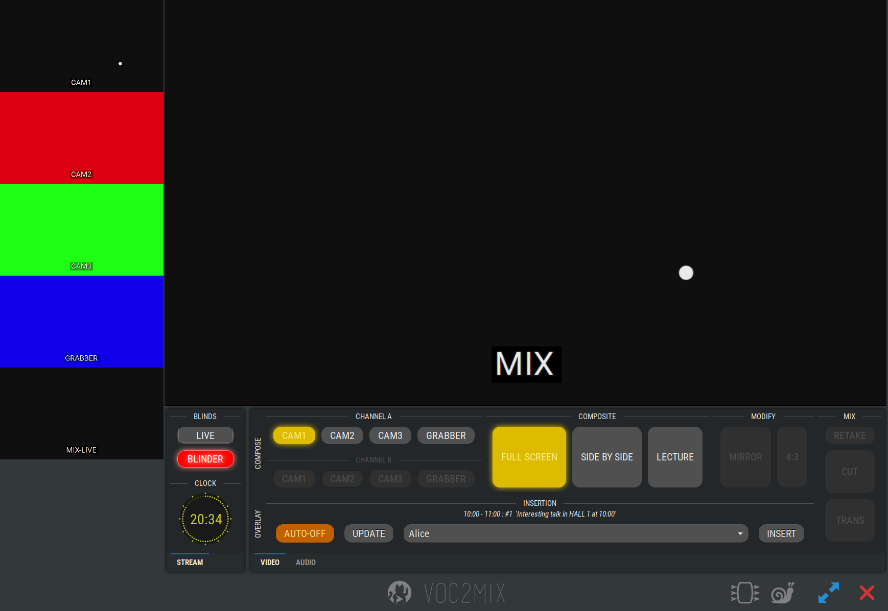

# 1. VOC2GUI

The GUI new front-end for **VOC2CORE**.

## 1.1. Contents

<!-- TOC -->

- [1.1. Contents](#11-contents)
- [1.2. Purpose](#12-purpose)
- [1.3. Installation](#13-installation)
- [1.4. Running](#14-running)
  - [1.4.1. Usage](#141-usage)
  - [1.4.2. Options](#142-options)
- [1.5. Configuration](#15-configuration)
  - [1.5.1. Connecting to Host](#151-connecting-to-host)
  - [1.5.2. Server Configuration Overwrites Client's One](#152-server-configuration-overwrites-clients-one)
  - [1.5.3. Main Window Properties](#153-main-window-properties)
    - [1.5.3.1. Window Size](#1531-window-size)
    - [1.5.3.2. Force Full Screen](#1532-force-full-screen)
    - [1.5.3.3. Main Window Toolbar](#1533-main-window-toolbar)
    - [1.5.3.4. Hide Close Button](#1534-hide-close-button)
    - [1.5.3.5. Show Full Screen Button](#1535-show-full-screen-button)
    - [1.5.3.6. Show Expert Buttons](#1536-show-expert-buttons)
  - [1.5.4. Mixing Toolbars](#154-mixing-toolbars)
    - [1.5.4.1. Common Widget and Button Configuration](#1541-common-widget-and-button-configuration)
    - [1.5.4.2. Sources Toolbars](#1542-sources-toolbars)
    - [1.5.4.3. Composites](#1543-composites)
    - [1.5.4.4. Modify Toolbar](#1544-modify-toolbar)
  - [1.5.5. Customize UI Style](#155-customize-ui-style)
- [1.6. Usage](#16-usage)

<!-- /TOC -->

## 1.2. Purpose

The **VOC2GUI** is a GUI client for **VOC2CORE**.
It can connect to a running **VOC2CORE** host and then uses *GTK* to provide a graphical interface to control a lot of the core's functionality.



Since the focus of VOC2MIX is to process and control the video mixing of a single A/V recorded talk on stage, **VOC2GUI** is the part where A/V mixing operators can get an easy to use interface to do their job while the event is running.

This include mixing video, audio, blinding of live output and monitoring the VOC2MIX setup.

After reading a configuration **VOC2GUI** connect to a host that is doing the bare work of mixing several input video and audio sources into several mixing outputs.
All A/V processing of the core is done by an underlying *GStreamer* instance that processes a so-called pipeline.
To understand what you are able to control with **VOC2GUI** you might first try to understand the principle pipeline construct of **VOC2CORE**.
In this document we presume that you know what your core was configured for.

## 1.3. Installation

Todo.

## 1.4. Running

### 1.4.1. Usage

```text
python3 voctogui.py [-h] [-v] [-c {auto,always,never}] [-t] [-i INI_FILE] [-H HOST] [-d] [-D GST_DEBUG_DETAILS] [-g]
```

### 1.4.2. Options

| Option | Alternative | Description
| ------ | ----- | -----
| `-h` | `--help` |  show this help message and exit
| `-v` | `--verbose` |  Set verbosity level by using `-v`, `-vv` or `-vvv`.
| `-c` { `auto`, `always`, `never` } | `--color` { `auto`, `always`, `never` } | Control the use of colors in the Log-Output.<br>Default: `auto`
| `-t` | `--timestamp` | Enable timestamps in the Log-Output
| `-i` *INI_FILE* | `--ini-file` *INI_FILE* | Load a custom configuration file *INI_FILE*.<br>Default: `./voctogui/default-config.ini`
| `-H` *HOST* | `--host` *HOST* | Connect to this host instead of the configured one.
| `-d` | `--dot` | Generate *DOT* graph files of pipelines into directory set by environment variable `GST_DEBUG_DUMP_DOT_DIR`
| `-D` *GST_DEBUG_DETAILS* | `--gst-debug-details` *GST_DEBUG_DETAILS* | Like `-d` but set detail level in *DOT* graph. *GST_DEBUG_DETAILS* must be a combination the following values:<br>`1` = show caps-name on edges<br>`2` = show caps-details on edges<br>`4` = show modified parameters on elements<br>`8` = show element states<br>`16` = show full element parameter values even if they are very long<br>Default: `15` = show all the typical details that one might want (`15=1+2+4+8`)
| `-g` | `--gstreamer-log` | Log gstreamer messages into voctocore log. <br>Set log level by using `-g`, `-gg` or `-ggg`).

## 1.5. Configuration

By default **VOC2GUI** reads a configuration file from it's repository called `./voctogui/default-config.ini` but it also asks the core for it's configuration.

### 1.5.1. Connecting to Host

Do be functional **VOC2GUI** has to connext to the a **VOC2CORE** instance via *TCP/IP*.
Usually this is done by setting the attribtue `server` / `host` within the configuration.

```ini
[server]
host=localhost
```

The `host` entry in the configuration is obligatory unsless you use `-H` to set the host.
The argument overrides the configuration if you use both at the same time.

### 1.5.2. Server Configuration Overwrites Client's One

The attributes in the core configuration overwrite the ones defined in the GUI's one so every item (except `server/host`) does not have to be included within the GUI configuration but can be defined by the core configuration to unify all connecting GUI instances.
Instead you could leave things more open to set them in the client configuration individually.

### 1.5.3. Main Window Properties

Because **VOC2GUI** is a *GTK* application it needs to open a main window on the screen.
You can influence the way this window appears by the following options:

```ini
[mainwindow]
width=1920
height=1080
forcefullscreen=true
```

#### 1.5.3.1. Window Size

Add pixel sizes to `width` and `height` to set the main window extents when not in full screen mode.

#### 1.5.3.2. Force Full Screen

Set `forcefullscreen` if you like **VOC2GUI** to start in full screen mode.

#### 1.5.3.3. Main Window Toolbar

The availability of the buttons in the main window toolbar can be customized by the following options:

```ini
[toolbar]
close=true
fullscreen=true
queues=true
ports=true
```

#### 1.5.3.4. Hide Close Button

Setting `close` to false will hide the close button which is on by default.

#### 1.5.3.5. Show Full Screen Button

By setting `fullscreen` to `true` a button wilöl appear which allows the user to toggle full screen mode.
Some window managers might still give the user the ability to toogle full screen mode even if this button is hidden.

#### 1.5.3.6. Show Expert Buttons

Setting `queues` and `ports` to `true` will show buttons which toggle the visiblity of the queues and the ports bar.

**Hint**: If you want to prevent the users to enable those features by changing the GUI configuration file you have to set it to `false` wthin the core configuration!

### 1.5.4. Mixing Toolbars

**VOC2GUI** can show several tool bars enveloping different aspects of the mixing process.
In the following paragraphs you learn how to configure them to customize availability of different functionalities, rename widgets, change keyboard accelerators and more.

#### 1.5.4.1. Common Widget and Button Configuration

Every mixing toolbar can be configured by using the following attributes.

| Attribute   | Description
| ----------- | --------------------------------------------
| `.key`      | Set the keyboard code that triggers this button.<br>See <https://developer.gnome.org/gtk3/stable/gtk3-Keyboard-Accelerators.html> about accelerator key codes in GTK.
| `.name`     | Customize name of the button on screen.
| `.tip`      | Customize the tool top of the button on screen.
| `.expand`   | Whether to expand the button within GTK layout.
| `.pos`      | Position (0..n) within the toolbar.<br>If not given append in order they appear in configuration.
| `.replace`  | Add composite modificator by character replacement (see chapter *Modifiers* below)

#### 1.5.4.2. Sources Toolbars

Without configuring the sources toolbars explicitly **VOC2GUI** lists automatically the available A/B sources as buttons and names them in upper case letters.
Tooltips will be generated too and keyboard accelerators will be set to `F1`..`F4` for sources A and `1`..`4` for sources B.
If you want to vary the visual appearance of the buttons you can use the two sections `toolbar.sources.a` and `toolbar.sources.b`:

```ini
[toolbar.sources.a]
buttons = cam,grabber

cam.name = CAMERA
cam.tip = Select camera on A

grabber.name = LAPTOP
grabber.tip = "Select speaker's laptop on A"

[toolbar.sources.b]
cam.name = CAMERA
cam.tip = Select camera on B

grabber.name = LAPTOP
grabber.tip = "Select speaker's laptop on B"
```

First you list all sources which shall be shown buttons for by using the `buttons` attribute followed by a comma separated list of the related source's names.
These sources must be defined within the host's configuration.

Then you might add one or more of the common attributes.

#### 1.5.4.3. Composites

Without any configuration composite buttons will be named automatically by their uppercased source names and keyboard accelerators will be `F5`..`F8`.

If you want to vary the visual appearance of the buttons you can use the two sections `toolbar.composites`:

```ini
[toolbar.composites]
buttons = fullscreen, sidebyside

fullscreen.name = FULL SCREEN
fullscreen.tip = Show channel A on full screen

sidebyside.name = SIDE BY SIDE
sidebyside.tip = Put channel A beside channel B
```

These composites must be defined within the host's configuration.

#### 1.5.4.4. Modify Toolbar

Without any configuration composite buttons will be named automatically by their uppercased source names and keyboard accelerators will be `F9`..`F12`.

```ini
[toolbar.mods]
buttons = mirror,ratio

mirror.name = MIRROR
mirror.replace = lec->|lec

ratio.name = 4:3
ratio.replace = lec->lec_43
```

```ini
[toolbar.mix]
```

```ini
[toolbar.insert]
```

### 1.5.5. Customize UI Style

Edit `voctogui/ui/voctogui.css` to change the way the user interface will be drawn.
Currently there is no list of class names or IDs but you might start **VOC2GUI** with *GTK* debugging to get these information by setting environment variable `GTK_DEBUG` to `interactive`:

```bash
GTK_DEBUG=interactive voctogui/voctogui.py
```

You will get a window which allows you to browse through all widgets within the **VOC2GUI** window.

## 1.6. Usage

Todo.