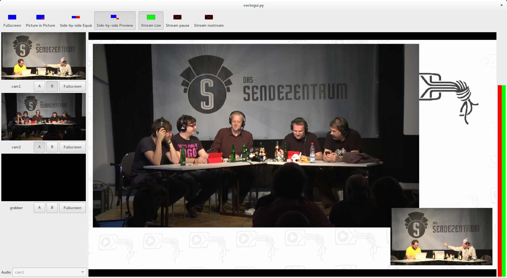

# Voctogui - The GUI frontend for Voctocore

## Keyboard Shortcuts
### Composition Modes
- `F1` Fullscreen
- `F2` Picture in Picture
- `F3` Side-by-Side Equal
- `F4` Side-by-Side Preview

### Select A-Source
- `1` Source Nr. 1
- `2` Source Nr. 2
- …

### Select B-Source
- `Ctrl+1` Source Nr. 1
- `Ctrl+2` Source Nr. 2
- …

### Set Fullscteen
- `Alt+1` Source Nr. 1
- `Alt+2` Source Nr. 2
- …

### Stream Blanking
- F11 Set stream to Pause-Loop
- F12 Set stream Live

### Other options
- `t` Cut

### Select an Audio-Source
Click twice on the selection combobox, then select your source within 5 Seconds. (It will auto-lock again after 5 seconds.)

## Configuration
On startup the GUI reads the following configuration files:
 - `<install-dir>/default-config.ini`
 - `<install-dir>/config.ini`
 - `/etc/voctomix/voctogui.ini`
 - `/etc/voctogui.ini`
 - `<homedir>/.voctogui.ini`
 - `<File specified on Command-Line via --ini-file>`

From top to bottom the individual settings override previous settings. `default-config.ini` should not be edited, because a missing setting will result in a Python exception.

On startup the GUI fetches all configuration settings from the core and merges them into the GUI config.
